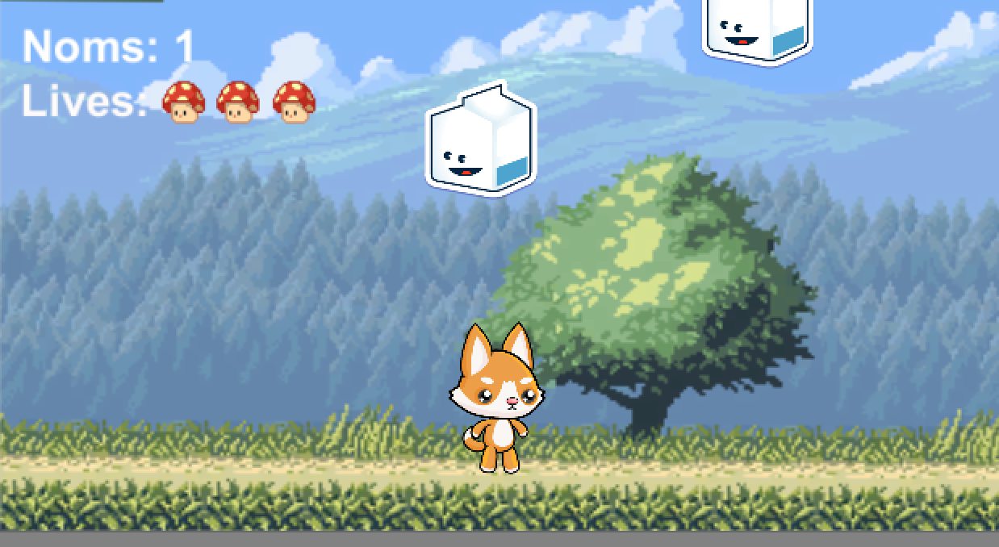

# NOMS
NOMS is a cute little game I made in Unity for my game development class at Northwestern. You play as a little fox character and catch as much food as possible. If you shoot mushrooms at the food, you get extra points! You win once your score surpasses, and you get a free compliment from a random compliment generator as a reward! :)

## Starting the Game
Make sure you have the latest version of Unity installed. You can start the game by opening up the file `ex5_2d/Assets/Scenes/Menu.unity`. 

